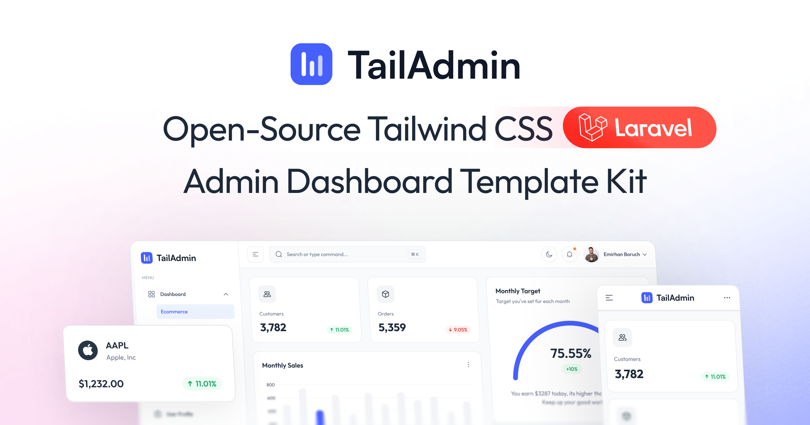

# TailAdmin Laravel - Tailwind CSS Free Laravel Dashboard

**TailAdmin Laravel** is a modern, production-ready admin dashboard template powered by **Laravel 12**, **Tailwind CSS v4**, **Alpine.js**, and a clean, modular architecture. TailAdmin is one of the most popular Tailwind CSS dashboard now also available for Larvael. It’s designed for building fast, scalable admin panels, CRM dashboards, SaaS backends, and any data-driven application where clarity and performance matter.



## Quick Links

* [✨ Get TailAdmin Laravel](https://tailadmin.com/laravel)
* [📄 Documentation](https://tailadmin.com/docs)
* [⬇️ Download](https://tailadmin.com/download)
* [🌐 Live Demo](https://laravel-demo.tailadmin.com)

Here’s a tighter, more search-friendly version that highlights value and avoids fluff while keeping your structure intact.

## ✨ Key Features

* 🚀 **Laravel 12 Core** - Built on the latest Laravel release with improved routing, security, and Blade templating
* 🎨 **Tailwind CSS v4** - Utility-first styling for rapid, consistent UI development
* ⚡ **Alpine.js Interactivity** - Lightweight reactivity without a heavy JavaScript framework
* 📦 **Vite Build System** - Fast dev server, instant HMR, and optimized production builds
* 📱 **Fully Responsive Layouts** - Smooth, mobile-first design that adapts across all screen sizes
* 🌙 **Built-in Dark Mode** - Ready-to-use modern dark theme for better usability and aesthetics
* 📊 **Advanced UI Components** - Charts, data tables, forms, calendars, modals, and reusable blocks for complex dashboards
* 🎯 **Production-Ready Dashboard UI** - Clean, modern interface crafted for real apps, not placeholder demos

### Other Versions

- [Next.js Version](https://github.com/TailAdmin/free-nextjs-admin-dashboard)
- [React.js Version](https://github.com/TailAdmin/free-react-tailwind-admin-dashboard)
- [Vue.js Version](https://github.com/TailAdmin/vue-tailwind-admin-dashboard)
- [Angular Version](https://github.com/TailAdmin/free-angular-tailwind-dashboard)
- [Laravel Version](https://github.com/TailAdmin/tailadmin-laravel)

## 📋 Requirements
To set up TailAdmin Laravel, make sure your environment includes:

* **PHP 8.2+**
* **Composer** (PHP dependency manager)
* **Node.js 18+** and **npm** (for compiling frontend assets)
* **Database** - Works with SQLite (default), MySQL, or PostgreSQL

### Tailwind CSS Laravel Dashboard

TailAdmin delivers a refined Tailwind CSS Laravel Dashboard experience, combining Laravel’s robust backend with Tailwind’s flexible utility classes. The result is a clean, fast, and customizable dashboard that helps developers build modern admin interfaces without the usual front-end complexity. It’s ideal for teams looking for a Tailwind-powered Laravel starter that stays lightweight and easy to scale.

### Laravel Admin Dashboard

If you’re searching for a dependable Laravel Admin Dashboard template that’s easy to set up and ready for production, TailAdmin fits the job. It offers a polished UI, reusable components, optimized performance, and all the essentials needed to launch dashboards, CRM systems, and internal tools quickly. It gives developers a solid foundation, so projects move faster with fewer decisions to worry about.

### Check Your Environment

Verify your installations:

```bash
php -v
composer -V
node -v
npm -v
```

## 🚀 Quick Start Installation

### Step 1: Clone the Repository

```bash
git clone https://github.com/TailAdmin/tailadmin-laravel.git
cd tailadmin-laravel
```

### Step 2: Install PHP Dependencies

```bash
composer install
```

This command will install all Laravel dependencies defined in `composer.json`.

### Step 3: Install Node.js Dependencies

```bash
npm install
```

Or if you prefer yarn or pnpm:

```bash
# Using yarn
yarn install

# Using pnpm
pnpm install
```

### Step 4: Environment Configuration

Copy the example environment file:

```bash
cp .env.example .env
```

**For Windows users:**

```bash
copy .env.example .env
```

**Or create it programmatically:**

```bash
php -r "file_exists('.env') || copy('.env.example', '.env');"
```

### Step 5: Generate Application Key

```bash
php artisan key:generate
```

This creates a unique encryption key for your application.

### Step 6: Configure Database

#### Option A: Using MySQL/PostgreSQL

Update your `.env` file with your database credentials:

```env
DB_CONNECTION=mysql
DB_HOST=127.0.0.1
DB_PORT=3306
DB_DATABASE=tailadmin_db
DB_USERNAME=your_username
DB_PASSWORD=your_password
```

Create the database:

```bash
# MySQL
mysql -u root -p -e "CREATE DATABASE tailadmin_db;"

# PostgreSQL
createdb tailadmin_db
```

Run migrations:

```bash
php artisan migrate
```

### Step 7: (Optional) Seed the Database

If you want sample data:

```bash
php artisan db:seed
```

### Step 8: Storage Link

Create a symbolic link for file storage:

```bash
php artisan storage:link
```

## 🏃 Running the Application

### Development Mode (Recommended)

The easiest way to start development is using the built-in script:

```bash
composer run dev
```

This single command starts:
- ✅ Laravel development server (http://localhost:8000)
- ✅ Vite dev server for hot module reloading
- ✅ Queue worker for background jobs
- ✅ Log monitoring

**Access your application at:** [http://localhost:8000](http://localhost:8000)

### Manual Development Setup

If you prefer to run services individually in separate terminal windows:

**Terminal 1 - Laravel Server:**
```bash
php artisan serve
```

**Terminal 2 - Frontend Assets:**
```bash
npm run dev
```

### Building for Production

#### Build Frontend Assets

```bash
npm run build
```

#### Optimize Laravel

```bash
# Clear and cache configuration
php artisan config:cache

# Cache routes
php artisan route:cache

# Cache views
php artisan view:cache

# Optimize autoloader
composer install --optimize-autoloader --no-dev
```

#### Production Environment

Update your `.env` for production:

```env
APP_ENV=production
APP_DEBUG=false
APP_URL=https://yourdomain.com
```


## 🧪 Testing

Run the test suite using Pest:

```bash
composer run test
```

Or manually:

```bash
php artisan test
```

Run with coverage:

```bash
php artisan test --coverage
```

Run specific tests:

```bash
php artisan test --filter=ExampleTest
```

## 📜 Available Commands

### Composer Scripts

```bash
# Start development environment
composer run dev

# Run tests
composer run test

# Code formatting (if configured)
composer run format

# Static analysis (if configured)
composer run analyze
```

### NPM Scripts

```bash
# Start Vite dev server
npm run dev

# Build for production
npm run build

# Preview production build
npm run preview

# Lint JavaScript/TypeScript
npm run lint

# Format code
npm run format
```

### Artisan Commands

```bash
# Start development server
php artisan serve

# Run migrations
php artisan migrate

# Rollback migrations
php artisan migrate:rollback

# Fresh migrations with seeding
php artisan migrate:fresh --seed

# Generate application key
php artisan key:generate

# Clear all caches
php artisan optimize:clear

# Cache everything for production
php artisan optimize

# Create symbolic link for storage
php artisan storage:link

# Start queue worker
php artisan queue:work

# List all routes
php artisan route:list

# Create a new controller
php artisan make:controller YourController

# Create a new model
php artisan make:model YourModel -m

# Create a new migration
php artisan make:migration create_your_table
```

## 📁 Project Structure

```
tailadmin-laravel/
├── app/                    # Application logic
│   ├── Http/              # Controllers, Middleware, Requests
│   ├── Models/            # Eloquent models
│   └── Providers/         # Service providers
├── bootstrap/             # Framework bootstrap files
├── config/                # Configuration files
├── database/              # Migrations, seeders, factories
│   ├── migrations/
│   ├── seeders/
│   └── factories/
├── public/                # Public assets (entry point)
│   ├── build/            # Compiled assets (generated)
│   └── index.php         # Application entry point
├── resources/             # Views and raw assets
│   ├── css/              # Stylesheets (Tailwind)
│   ├── js/               # JavaScript files (Alpine.js)
│   └── views/            # Blade templates
├── routes/                # Route definitions
│   ├── web.php           # Web routes
│   ├── api.php           # API routes
│   └── console.php       # Console routes
├── storage/               # Logs, cache, uploads
│   ├── app/
│   ├── framework/
│   └── logs/
├── tests/                 # Pest test files
│   ├── Feature/
│   └── Unit/
├── .env.example           # Example environment file
├── artisan                # Artisan CLI
├── composer.json          # PHP dependencies
├── package.json           # Node dependencies
├── vite.config.js         # Vite configuration
└── tailwind.config.js     # Tailwind configuration
```

## 🐛 Troubleshooting

### Common Issues

#### "Class not found" errors
```bash
composer dump-autoload
```

#### Permission errors on storage/bootstrap/cache
```bash
chmod -R 775 storage bootstrap/cache
```

#### NPM build errors
```bash
rm -rf node_modules package-lock.json
npm install
```

#### Clear all caches
```bash
php artisan optimize:clear
```

#### Database connection errors
- Check `.env` database credentials
- Ensure database server is running
- Verify database exists

## 🔄 Update Log

### [2026-03-15]
- Fixed PHP 8.5 deprecation warning

### [2025-12-29]
- Added Date Picker in Statistics Chart

## License

Refer to our [LICENSE](https://tailadmin.com/license) page for more information.
